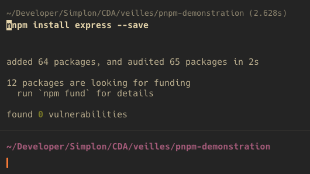
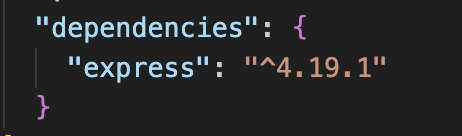
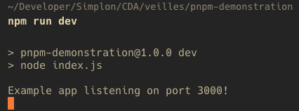

# Packages? NPM? PNPM?

Voici une petite présentation/démo de l'utilité du package manager NPM. 

Un PDF est présent pour une introduction. 

Les instruction ci-dessous servent à suivre la démo. 


## Comment installer des packages

Pour installer des packages (bouts codes/modules/bibliothèque) on a besoin des éléments suivants:

- Un répertoire pour publier / récupérer des packages
- un CLI (interface de ligne de commande) pour installer et désinstaller des packages: votre terminal fera l'affaire
- un registre: c'est la base de données d'NPM contenant les packages
- une version de Node.js (runtime javascript) installée sur notre machine

Les projets Javascript contient un fichier package.json qui contient les donéés du projet et des packages qu'on utilise dans le projet.

## Package.json

Pour initialiser un fichier package.json on utilise la commande suivante:

```
npm init -y
```

Le flag -y ou --yes génère le squelette par défaut du package.json sans demander d'input

Les données principales du package.json sont les suivantes:

### Name

Le nom du projet.

Il reprend par défaut le nom de votre dossier. Pour moi c'est "pnpm demonstration".

### Version

La version du projet.

Par défaut: 1.0.0. Le nommage de la version suit des règles spécifiques: https://docs.npmjs.com/about-semantic-versioning

### Description:

Décrit votre projet et aider les utilisateurs d'NPM si vous publiez le projet.

### Main

Le point d'entrée de votre projet.

La valeur par défaut est index.js. Pour un élément de comparaison, c'est comme index.php pour un projet php.

### Scripts

Ici vous pouvez préciser des tâches à éxecuter sur votre projet.

Le principal intérêt est de lancer des scripts sans devoir taper toute la commande. Quand vous utilisez des frameworks, des scripts par défaut seront dans les scripts et vous permettront par exemple de lancer votre serveur local avec le script "npm run dev" ou compiler votre projet avec "npm run build". Les scripts sont configurables et sont à éxecuter depuis un CLI (votre terminal).

### Dependencies:

Liste toutes les dépendances utilisées dans votre projet.

Quand vous utilisez la commande "npm install <package>", Le package est ajouté automatiquement aux dépendances avec sa version utilisée.

### Repository

Contient le lien URL du code source du projet ainsi que le type d'outil de versionnement

### Keywords

Des mots clés qui permet aux utilisateur NPM de trouver votre projet

### Author

Le créateur du projet

### License

Le type de license accordée au projet.

Des licences communément utilisées:

license ICS: https://fr.wikipedia.org/wiki/Licence_ISC

license MIT: https://fr.wikipedia.org/wiki/Licence_MIT

## Comment installer une dépendance ?

Tout d'abord on distingue les dépendances (dependencies) des dépendances de développement (devDependencies).

Les dépendances de développement sont utilisées... seulement en développement. Les dependencies 'normales' sont celles qui vont être utilisées en production. Par exemple, un package pour faire des test (ex: Jest) est une dépendance de développement mais dans la version production (version finale du projet) n'en a pas besoin et donc on ne l'intègre pas!

### Pour installer une dépendance

On utilise les commandes suivantes

npm install avec les flags suivants:

#### Pour installer une dépendance normale

```
--save
--S
```

#### Pour installer une dépendance de développement

```
--save-dev
--D
```

#### Pour installer les dépendances d'un projet sans inclure les dépendances de développement

```
--production
```

#### Pour installer un package en global sur la machine

```
--global
--g
```

## Demonstration

On peut illustrer l'utilisation d'NPM/PNPM en installant des packagees très populaires.

### Installer express

Express est un framework permettant d'utiliser javascript côté serveur.
Javascript de base est un langage utilisé pour les navigateurs mais grâce à Node.js, un runtime utilisant javascript. On peut développer notre back-end et notre front-end avec un seul langage.

- [Lien vers Express.js](https://expressjs.com/fr/)
- [Lien vers Node.js](https://nodejs.org/en)

Grâce à NPM, notre package manager, on va installer le code réalisé par les créateurs d'Express pour utiliser leur framework sur notre projet. On installe donc un package.

### Installation

Dans votre CLI (terminal), exécutez la commande suivante:

```
npm install express --save
```

Ici on installe donc la package 'express' dans nos dépendances normales.

Regardez votre terminal ainsi que votre fichier package.json, vous devriez voir ceci:



Le package (qui contient lui même des dépendances et donc des packages) a bien été installé.
Des vérifications sont faites pour détecter des vulnérabilités, du code déprécié et les résultats sont affichés dans votre terminal.



On peut voir que désormais, la dépendance a bien été installé dans notre projet. Dans notre cas, Express est prêt a être utilisé.

### Utiliser notre package

Maintenant que notre package express est installé, utilisons-le.

Rappelez-vous, notre point d'entrée est index.js, créeons donc ce fichier.

Faites le à la main ou alors dans votre terminal depuis le dossier du projet:

```
touch index.js
```

Dans votre fichier index.js, ajouter le code suivant:

```
const express = require("express");
const app = express();
const port = 3000;

app.get("/", (req, res) => res.send("Hello World!"));
app.listen(port, () => console.log(`Example app listening on port ${port}!`));
```

Dans ce code on:

- import express
- instancie un app en appellant le méthode express()
- définie un port pour notre application
- définie une route '/', pour laquelle on envoie la réponse 'Hello, World!'
- on écoute l'app sur le port spécifié

### Ajouter un script

Ajoutons un script pour faciliter le lancement de notre serveur local.

Dans le package.json dans la partie scripts, ajoutez:

```
"dev": "node index.js"
```

Grâce à ce script, on peut désormais lancer notre serveur local en utilisant la commande 'npm run dev' depuis notre terminal plutôt que 'node index.js'

Maintenant, lancez la commande dans votre terminal.

Vous verrez ceci affiché dans votre terminal:



Le serveur local de votre application a bien été lancé. Surtout, ne coupez pas ce processus pendant que vous développez sinon votre serveur local se coupera!

Ensuite, si vous allez sur http://localhost:3000/ vous verrez 'Hello, World!' affiché. Notre code fonctionne.

Ce que nous venons de faire par étapes:

- Initialiser un projet
- Installer une dépendance
- Utiliser une dépendance
- Personnaliser nos scripts

Ce workflow fait partie de l'environnement central du développement web et vous serez amené à l'utliser très souvent.

## Et PNPM dans tout ça?

Et bien PNPM rempli le même rôle qu'NPM mais avec quelques avantages.

Je vous laisse regarder le PDF présent dans le projet pour en apprendre plus!
